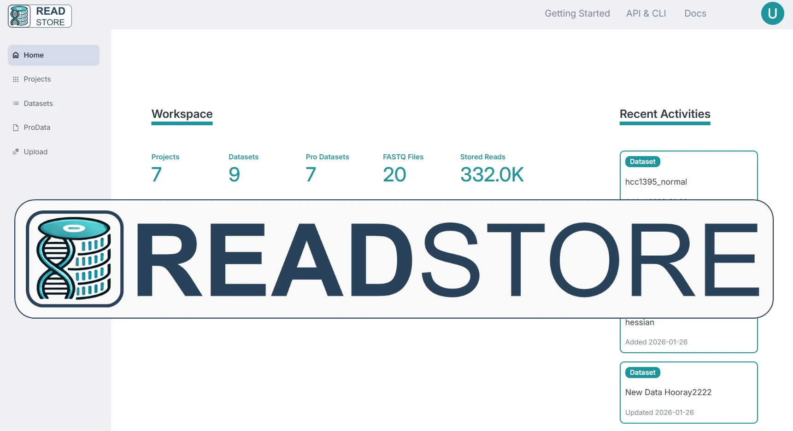

# ReadStore Basic

The Lean Solution for Managing NGS and Omics Data
 

- **Database** for FASTQ, analysis and metadata files
- **Project management** and collaborative workspace
- **APIs** for Terminal, Python and R for automation of data analysis

ReadStore is a platform for storing, managing, and integrating omics data. It speeds up analysis and offers a simple way of managing and sharing NGS omics datasets, metadata and processed data (Processed Data). Built-in project and metadata management structures your workflows and a collaborative user interface enhances teamwork — so you can focus on generating insights.

The integrated API enables you to directly retrieve data from ReadStore via the terminal Command-Line Interface (CLI) or Python / R SDKs.

The ReadStore Basic version offers a local web server with simple user management. If you need organization-wide deployment, advanced user and group management, or cloud integration, please check the ReadStore Advanced versions and reach out to <a href="mailto:info@evo-byte.com">info@evo-byte.com</a>.

Find more information on <a href="https://www.evo-byte.com/readstore">www.evo-byte.com/readstore</a>

## Quickstart

ReadStore Basic allows you to manage NGS and omics data through a web interface and command-line tools. Follow these steps to get started:

1.**Install ReadStore Basic**

  `pip3 install readstore-basic`

 

2.**Start the server**: 

  `readstore-server`

 

3.**Access the web app**

  Open your browser and navigate to `http://localhost:8501`

 

4.**Upload FASTQ datasets**

  In the UI, navigate to the *Upload Page* and click Import to ingest FASTQ files.

  Check In datasets after QC is completed. 

 

5.**Install the CLI** (optional)

  `pip3 install readstore-cli`

 

6.**Configure the CLI**

  Run `readstore configure` and enter your username and token

 

7.**Upload FASTQ files**

  Use `readstore upload myfile_r1.fastq` to upload sequencing data

 

<!-- 
## Tutorials & How-Tos

Here you can find more information how to setup and work with ReadStore

### ReadStore Blog

#### 1. Upload and Check In FASTQ files

Learn how to upload or import FASTQ files, and check in datasets. [Read more](https://evo-byte.com/readstore-tutorial-uploading-staging-fastq-files/)

#### 2. Upload and Check In FASTQ files

Learn how to upload or import FASTQ files, and check in datasets. [Read more](https://evo-byte.com/readstore-tutorial-uploading-staging-fastq-files/)

#### 3. Upload and Check In FASTQ files

Learn how to upload or import FASTQ files, and check in datasets. [Read more](https://evo-byte.com/readstore-tutorial-uploading-staging-fastq-files/)

#### 4. Upload and Check In FASTQ files

Learn how to upload or import FASTQ files, and check in datasets. [Read more](https://evo-byte.com/readstore-tutorial-uploading-staging-fastq-files/)
 -->
